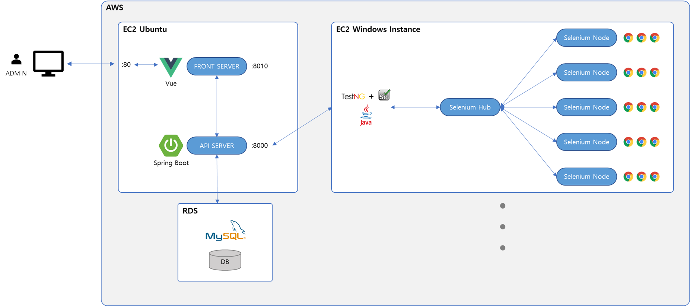
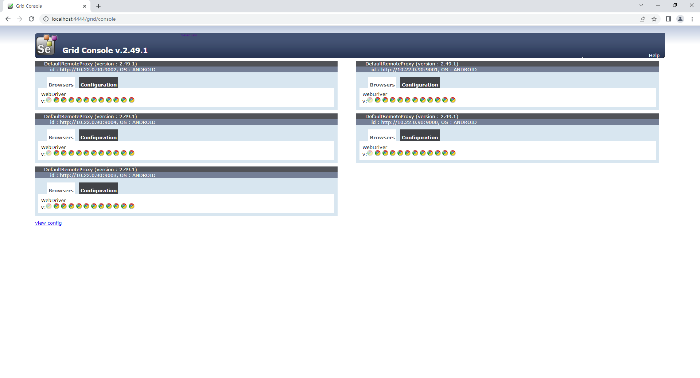
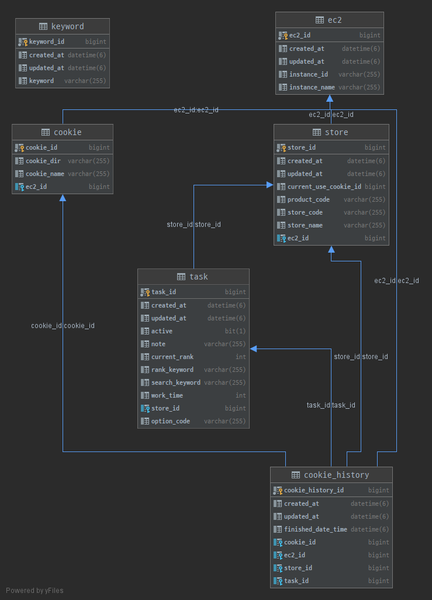
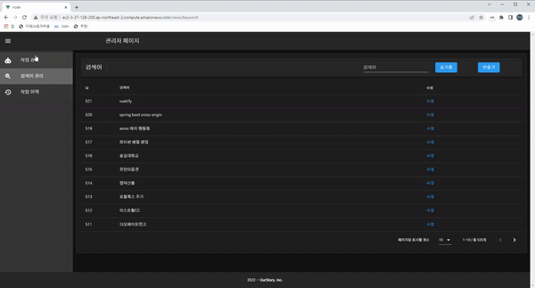
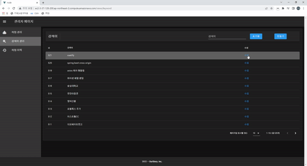
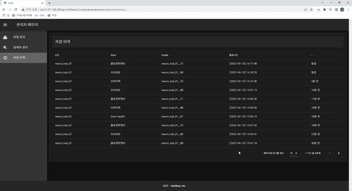

# MACRO MANAGEMENT SYSTEM
본 문서는 [프리모아](https://www.freemoa.net/)를 통해 진행한 외주 개발 프로젝트의 개발 보고서입니다.

- [해당 프로젝트 공고](https://www.freemoa.net/m4/s41?page=1&sS=%EC%82%AC%EB%82%B4%EC%9A%A9+%EB%84%A4%EC%9D%B4%EB%B2%84+%EA%B2%80%EC%83%89+%EB%A7%A4%ED%81%AC%EB%A1%9C+%ED%94%84%EB%A1%9C%EA%B7%B8%EB%9E%A8+%EA%B0%9C%EB%B0%9C&pno=41244&first_pno=41244)


## 개요
본 문서에서는 위 프로젝트를 통해 개발한 서비스를 `MACRO MANAGEMENT SYSTEM`으로 호칭합니다.

본 문서는 시스템 구축 내용을 설명합니다.

## 📑 Revision History Of Document

문서 수정 내역

| No. | Date. | Description |
|:---:|:---|:---:|
| 1 | 2022-04-10 | 첫 문서 작성, 시스템 구성도 및 사용자 설명 내용 추가 |

## System Architecture
  

`MACRO MANAGEMENT SYSTEM`은 크게 아래와 같은 구성요소로 되어 있습니다.
1. [Selenium Grid](#1-Selenium-Grid)
2. [Macro](#2-Macro)
3. [DB](#3-DB)
4. [API SERVER](#4-API-SERVER)
5. [FRONT SERVER](#5-FRONT-SERVER)

## 1. Selenium Grid
메인 hub 에서 각 node 로 병렬 처리를 지원합니다.  
EC2 인스턴스에서 hub와 node 를 띄워놓으면 매크로를 돌릴 수 있습니다.

#### Requirements:
- java 11
- selenium-server-standalone-2.49.1.jar
- Chrome
- Chrome Driver

#### Command:
```shell
# Hub 를 띄운다.
java -jar selenium-server-standalone-2.49.1.jar -role hub

# node를 병렬처리할 만큼 실행시킨다
java -Dwebdriver.chrome.driver="{{chrome_driver_path}}" -jar selenium-server-standalone-2.49.1.jar -role node -hub http://{{host_ip}}:4444/grid/register/ -port {{port}} -browser "browserName=chrome,maxInstances=10,platform=ANDROID,maxSession=10"

```
#### Console:
localhost:4444 로 접속하면 떠있는 노드를 확인 할 수 있습니다.  
> 
위와 같이 정상적으로 셋팅이 완료되면 매크로를 실행할 준비가 완료 되었습니다.

## 2. Macro
특정한 키워드를 검색하여 타겟에 트래픽을 전달합니다.  
testng 를 통해 병렬처리를 지원합니다.  
해당 프로세스는 죽이지 않는한 계속 반복됩니다.  

해당 프로세스는 aws ec2 windows 인스턴스 내에서 실행됩니다.

#### Requirements:
- java 11
- Maven
- testng

#### Command:
```shell

# 프로젝트 디렉토리로 이동
cd {project_directory}

# 매크로 실행
mvn -P ExecuteTestSuite test
```

testng.xml
```xml
<?xml version="1.0" encoding="UTF-8"?>
<!DOCTYPE suite SYSTEM "http://testng.org/testng-1.0.dtd">
<suite    name="All Test Suite" parallel="methods" thread-count="5">
    <test name="Test1">
        <classes>
            <class name="com.ourstory.macro.MacroRunner"/>
        </classes>
    </test>
</suite>
```
testng.xml 을 통해 설정을 할 수 있습니다.

## 3. DB
DB 는 mysql 을 사용하며 aws 를 통해 운영됩니다.

#### Schema
2022-04-10 기준 현재 스키마는 아래와 같습니다.
(추후 변경 가능성 있음)
> 

| No. | Table. | Description |
|:---:|:---|:---:|
| 1 | ec2 | EC2 인스턴스 정보 테이블 |
| 2 | keyword | 검색어 관리 테이블 |
| 3 | cookie | 쿠키 관리 테이블 |
| 4 | store | 상점 관리 테이블 |
| 5 | task | 작업 관리 테이블 |
| 6 | cookie_history | 작업 이력 관리 테이블 |


## 4. API SERVER
봇의 쿠키 분배 처리 등 비즈니스 API,  
각 리소스에 대한 REST API,   
검색 API 를 제공합니다. 

해당 서버는 aws ec2 ubuntu 인스턴스에서 실행됩니다.

#### Requirements:
- java 11
- maven
- spring boot 2.6.6


**REST API LIST**
```json
{
  "_links" : {
    "eC2Instances" : {
      "href" : "http://ec2-3-37-128-200.ap-northeast-2.compute.amazonaws.com:8000/api/v1/ec2{?page,size,sort}",
      "templated" : true
    },
    "cookies" : {
      "href" : "http://ec2-3-37-128-200.ap-northeast-2.compute.amazonaws.com:8000/api/v1/cookies{?page,size,sort}",
      "templated" : true
    },
    "tasks" : {
      "href" : "http://ec2-3-37-128-200.ap-northeast-2.compute.amazonaws.com:8000/api/v1/tasks{?page,size,sort}",
      "templated" : true
    },
    "stores" : {
      "href" : "http://ec2-3-37-128-200.ap-northeast-2.compute.amazonaws.com:8000/api/v1/stores{?page,size,sort}",
      "templated" : true
    },
    "cookieHistories" : {
      "href" : "http://ec2-3-37-128-200.ap-northeast-2.compute.amazonaws.com:8000/api/v1/cookieHistories{?page,size,sort}",
      "templated" : true
    },
    "keywords" : {
      "href" : "http://ec2-3-37-128-200.ap-northeast-2.compute.amazonaws.com:8000/api/v1/keywords{?page,size,sort}",
      "templated" : true
    },
    "profile" : {
      "href" : "http://ec2-3-37-128-200.ap-northeast-2.compute.amazonaws.com:8000/api/v1/profile"
    }
  }
}
```

**BUSINESS API LIST**
- GET /checkRunnable?{taskId}
    - 해당 task 가 실행 할 수 있는지 true, false 반환해줍니다.
- GET /cookie/runnable?{taskId}
    - 사용 가능한 쿠키 정보를 할당받습니다.
- POST /task/logging?{taskId,cookieId}
    - 작업이 끝나면 작업 이력 로깅을 처리합니다.

**SEARCH API LIST**
- POST /search/task
    - 작업 검색을 지원합니다.
        - 상점명 (like 검색)
        - 검색키워드 (like 검색)
- POST /search/keyword
    - 검색어 검색을 지원합니다.
        - 검색어 (like 검색)
- POST /search/history
    - 작업 이력 검색을 지원합니다.
        - 상점 ID (eq 검색)

## 5. FRONT SERVER
[사이트 보기](http://ec2-3-37-128-200.ap-northeast-2.compute.amazonaws.com/)  
관리자 UI 를 제공합니다.  

해당 서버는 aws ec2 ubuntu 인스턴스에서 실행됩니다.

#### Requirements:
- node 16

> 
#### Features
**작업 관리 페이지**
- 작업 관리 기능
    - 작업횟수 수정 가능 (10 ~ 110)
    - 이용 여부 수정 가능 
    - 메모 수정 가능 
- 페이징 기능
- 검색 기능
    - 상점명으로 검색
    - 상품찾아가는 키워드로 검색

<br />

> 
#### Features
**검색어 관리 페이지**
- 검색어 추가 기능
- 페이징 기능
- 검색 기능
    - 검색어

<br />

> 
#### Features
**작업 이력 페이지**
- 페이징 기능

<br />
